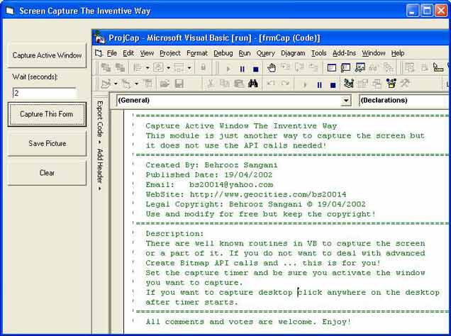



## Capture Active Window The Inventive Way \(without API calls\)

### Description

Capture snapshots of your active window, taskbar, desktop or even start menu itself WITHOUT API calls!!! No create bitmaps and palletes. Just capture and save by clicking on them. It practically captures anything active. See Screenshot taken by the program itself or download it (2.5 Kb). If you like it, please come back and give comments or vote...
 
### More Info
 

             |
---                |---
**Submitted On**   |2002-04-19 12:44:14
**By**             |[Behrooz Sangani](https://github.com/Planet-Source-Code/PSCIndex/blob/master/ByAuthor/behrooz-sangani.md)
**Level**          |Beginner
**User Rating**    |3.6 (43 globes from 12 users)
**Compatibility**  |VB 6\.0
**Category**       |[Graphics](https://github.com/Planet-Source-Code/PSCIndex/blob/master/ByCategory/graphics__1-46.md)
**World**          |[Visual Basic](https://github.com/Planet-Source-Code/PSCIndex/blob/master/ByWorld/visual-basic.md)
**Archive File**   |[Capture\_Ac736214192002\.zip](https://github.com/Planet-Source-Code/behrooz-sangani-capture-active-window-the-inventive-way-without-api-calls__1-33946/archive/master.zip)

